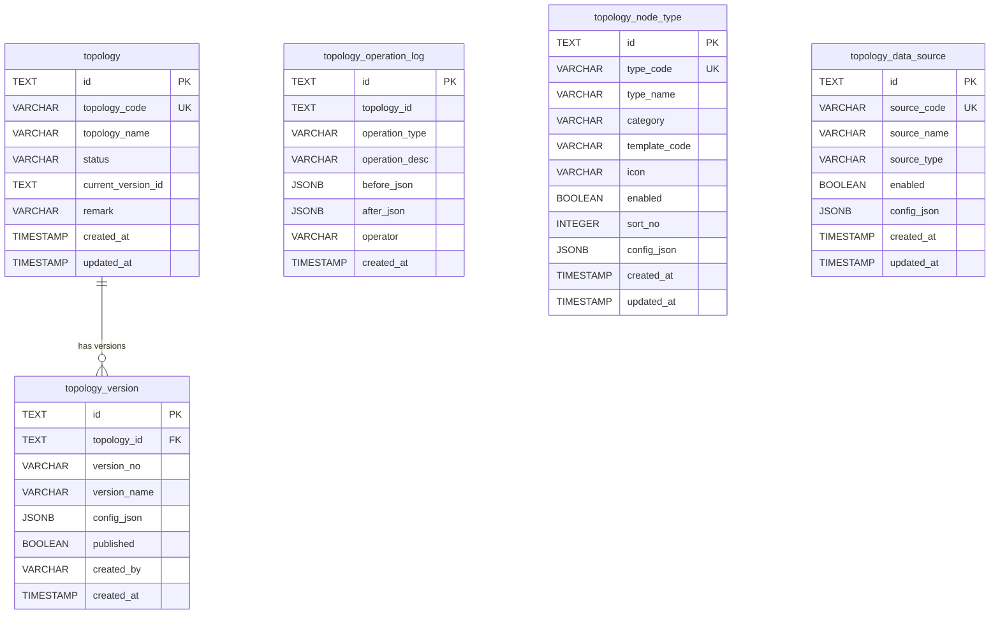

# 09-后端业务点、表结构与数据库脚本

## 后端现状

当前后端是轻量 Fastify + Prisma 实现，业务逻辑主要写在 `apps/server/src/modules/*` 的路由处理函数里，暂未拆分独立 service 层。

后端入口：

- `apps/server/src/main.ts`

主要模块：

- `node-types.ts`：节点类型管理。
- `data-sources.ts`：数据源管理与预览。
- `topologies.ts`：拓扑保存、读取、版本列表、发布。
- `runtime.ts`：运行态数据源聚合查询。
- `assets.ts`：图片资源上传与访问。

共享类型和 schema：

- `packages/topology-shared/src/types/*`
- `packages/topology-shared/src/schemas/topology.ts`

## 后端业务点

### 健康检查

接口：

- `GET /api/health`

业务点：

- 返回服务名和当前时间。
- 不访问数据库。

### 节点类型管理

接口：

- `GET /api/topology/node-types`
- `POST /api/topology/node-types`
- `DELETE /api/topology/node-types/:id`

业务点：

- 查询时只返回 `enabled = true` 的节点类型。
- 按 `sortNo asc`、`createdAt asc` 排序。
- 新增或编辑使用 `typeCode` 做 upsert。
- 未传端口时，接口会使用共享包里的默认四方向端口。
- 删除是软删除，将 `enabled` 更新为 `false`。

当前未实现：

- 没有单独的 `PUT /api/topology/node-types/:id`。
- 没有校验节点类型是否已经被拓扑版本引用。
- 没有使用 Zod schema 校验节点类型配置完整性。
- 没有操作日志。

### 数据源管理

接口：

- `GET /api/topology/data-sources`
- `POST /api/topology/data-sources`
- `POST /api/topology/data-sources/preview`

业务点：

- 查询时只返回 `enabled = true` 的数据源。
- 新增或编辑使用 `sourceCode` 做 upsert。
- 未传 `enabled` 时默认启用。
- 预览接口只读取数据源配置里的 `configJson.data`。
- 预览接口支持按 `fields` 筛选返回字段。

当前未实现：

- 没有单独的 `PUT /api/topology/data-sources/:id`。
- 没有 `DELETE /api/topology/data-sources/:id`。
- 预览暂不实际请求 HTTP、WebSocket、MQTT。
- HTTP 数据源没有白名单、超时、鉴权、错误隔离。
- 没有操作日志。

### 拓扑管理

接口：

- `GET /api/topologies`
- `GET /api/topologies/:id`
- `POST /api/topologies`
- `PUT /api/topologies/:id`
- `GET /api/topologies/:id/versions`
- `POST /api/topologies/:id/publish`

业务点：

- 列表接口返回拓扑主表信息和最新版本号。
- 详情接口返回最新创建的拓扑版本 `configJson`。
- 新建拓扑时状态固定为 `draft`。
- 保存拓扑时使用 `topologyDataSchema` 做结构校验。
- 更新拓扑使用 `topologyCode` upsert 主表，并新增一条草稿版本。
- 版本列表按 `createdAt desc` 返回。
- 发布时只检查拓扑存在且存在至少一个版本。
- 发布成功后：
  - 最新版本 `published = true`。
  - 拓扑主表 `status = published`。
  - 拓扑主表 `currentVersionId = version.id`。

当前未实现：

- 没有保存前轻校验：
  - 节点 key 唯一。
  - 连线 key 唯一。
  - 连线起点和终点存在。
  - 端口存在。
  - 节点类型存在。
  - 分组引用存在。
  - 动态表单必填字段完整。
- 没有发布前强校验：
  - 连接规则。
  - 数据源可访问。
  - 映射字段存在。
  - 模板变量存在映射。
  - 规则字段存在。
  - 不存在循环依赖规则。
  - 关键设备不能孤立。
- 发布版本仍可能继续被后续逻辑间接覆盖状态。
- 没有按指定版本读取拓扑。
- 没有操作日志。
- 没有权限判断。

### 运行态聚合查询

接口：

- `POST /api/topologies/:id/runtime/query`

请求核心字段：

- `sourceIds`：要查询的数据源编码。
- `fields`：要返回的字段。
- `preview`：是否使用 mock/static 预览数据。
- `metaData`、`parentParams`：模板表达式上下文。
- `sources`：请求内嵌数据源配置。

业务点：

- 数据库数据源只查询 `enabled = true`。
- 请求体里的内嵌 `sources` 优先级高于数据库配置。
- `preview = true` 时优先返回 `mockData`，其次返回 `data`。
- `type = static` 时返回 `data`，没有则返回 `mockData`。
- `type = http` 时会按配置发起 HTTP 请求。
- HTTP 请求支持模板变量替换：
  - URL
  - headers
  - query
  - body
- 字段筛选支持点路径。
- 每个数据源响应都会补充：
  - `_quality`
  - `_timestamp`

当前未实现：

- 路径里的拓扑 ID 暂未参与查询约束。
- 没有运行态版本读取。
- HTTP 请求没有超时和错误兜底。
- 某个数据源失败可能影响整个聚合接口。
- WebSocket、MQTT 类型暂回退到静态数据。

### 图片资源

接口：

- `POST /api/topology/assets`
- `GET /uploads/:fileName`

业务点：

- 支持格式：
  - png
  - jpg/jpeg
  - webp
  - gif
  - svg
- 上传内容必须是 base64 dataUrl。
- 文件最大 5MB。
- SVG 必须包含 `<svg`。
- SVG 禁止 `<script`。
- SVG 禁止 `onxxx=` 事件属性。
- 文件名会过滤为安全字符。
- 文件保存在后端运行目录的 `uploads` 下。

当前未实现：

- 没有用户、权限和租户隔离。
- 没有文件去重。
- 没有删除接口。
- 读取文件不存在时没有业务化错误处理。

## 数据库表结构

数据库使用 PostgreSQL，ORM 使用 Prisma。

当前 Prisma schema：

- `apps/server/prisma/schema.prisma`

当前没有 migrations 目录，项目通过 `prisma db push` 同步结构。

### 表关系总览



说明：

- 目前只有 `topology_version.topology_id -> topology.id` 建了数据库外键。
- `topology.current_version_id` 保存当前发布版本 ID，但 Prisma schema 暂未声明外键关系。
- `topology_operation_log.topology_id` 只建索引，暂未声明外键，便于日志保留或后续补齐审计策略。
- 节点类型、数据源与拓扑版本之间的引用关系保存在 `config_json` 中，当前没有数据库级外键。

### 表清单

| 表名 | Prisma Model | 用途 | 主要写入入口 |
|---|---|---|---|
| `topology_node_type` | `TopologyNodeType` | 节点类型、模板、端口、表单和默认样式配置 | 节点类型接口、`seed.ts` |
| `topology_data_source` | `TopologyDataSource` | 静态、HTTP、WebSocket、MQTT 等数据源配置 | 数据源接口、`seed.ts` |
| `topology` | `Topology` | 拓扑主记录、状态和当前发布版本指针 | 拓扑新增、保存、发布、`seed.ts` |
| `topology_version` | `TopologyVersion` | 每次保存生成一条完整拓扑 JSON 版本 | 拓扑新增、保存、`seed.ts` |
| `topology_operation_log` | `TopologyOperationLog` | 操作审计日志预留表 | 当前未写入 |

### 通用字段约定

- 主键 `id` 使用 Prisma Client 生成的 `cuid()`，数据库 DDL 中没有默认值。
- `created_at` 使用数据库默认值 `CURRENT_TIMESTAMP`。
- 带 `@updatedAt` 的 `updated_at` 由 Prisma Client 在写入时维护，数据库没有触发器。
- 业务编码字段使用唯一索引：
  - `topology_node_type.type_code`
  - `topology_data_source.source_code`
  - `topology.topology_code`
- JSON 配置统一使用 PostgreSQL `JSONB`。

### topology_node_type

用途：节点类型定义表。

| 字段 | 类型 | 约束 | 说明 |
|---|---|---|---|
| `id` | `TEXT` | 主键 | Prisma cuid |
| `type_code` | `VARCHAR(64)` | 唯一、非空 | 节点类型编码 |
| `type_name` | `VARCHAR(128)` | 非空 | 节点类型名称 |
| `category` | `VARCHAR(32)` | 非空 | 分类：equipment/container/annotation/control |
| `template_code` | `VARCHAR(64)` | 非空 | 前端 GoJS 模板编码 |
| `icon` | `VARCHAR(512)` | 可空 | 图标或图片引用 |
| `enabled` | `BOOLEAN` | 默认 true | 是否启用 |
| `sort_no` | `INTEGER` | 默认 0 | 排序号 |
| `config_json` | `JSONB` | 非空 | 端口、表单、绑定字段、动作等配置 |
| `created_at` | `TIMESTAMP(3)` | 默认当前时间 | 创建时间 |
| `updated_at` | `TIMESTAMP(3)` | 非空 | 更新时间，Prisma 写入时维护 |

索引和约束：

- 主键：`topology_node_type_pkey(id)`。
- 唯一索引：`topology_node_type_type_code_key(type_code)`。

`config_json` 当前主要保存：

- `description`
- `defaultSize`
- `statusImages`
- `isGroup`
- `canContain`
- `allowNestedGroup`
- `ports`
- `formSchema`
- `groupStyleDefaults`
- `annotationDefaults`
- `buttonDefaults`
- `buttonStyleDefaults`

### topology_data_source

用途：数据源定义表。

| 字段 | 类型 | 约束 | 说明 |
|---|---|---|---|
| `id` | `TEXT` | 主键 | Prisma cuid |
| `source_code` | `VARCHAR(64)` | 唯一、非空 | 数据源编码 |
| `source_name` | `VARCHAR(128)` | 非空 | 数据源名称 |
| `source_type` | `VARCHAR(32)` | 非空 | http/websocket/mqtt/static |
| `enabled` | `BOOLEAN` | 默认 true | 是否启用 |
| `config_json` | `JSONB` | 非空 | URL、method、data、mockData、headers、query、body 等 |
| `created_at` | `TIMESTAMP(3)` | 默认当前时间 | 创建时间 |
| `updated_at` | `TIMESTAMP(3)` | 非空 | 更新时间，Prisma 写入时维护 |

索引和约束：

- 主键：`topology_data_source_pkey(id)`。
- 唯一索引：`topology_data_source_source_code_key(source_code)`。

`source_type` 当前业务侧支持：

- `static`
- `http`
- `websocket`
- `mqtt`

`config_json` 当前主要保存：

- 静态数据：`data`、`mockData`
- HTTP 配置：`url`、`method`、`headers`、`query`、`body`
- 运行态模板变量会在接口层替换，数据库只保存原始配置。

### topology

用途：拓扑主表，保存检索字段和当前发布版本指针。

| 字段 | 类型 | 约束 | 说明 |
|---|---|---|---|
| `id` | `TEXT` | 主键 | Prisma cuid |
| `topology_code` | `VARCHAR(64)` | 唯一、非空 | 拓扑编码 |
| `topology_name` | `VARCHAR(128)` | 非空 | 拓扑名称 |
| `status` | `VARCHAR(32)` | 非空 | draft/published/archived |
| `current_version_id` | `TEXT` | 可空 | 当前发布版本 ID |
| `remark` | `VARCHAR(512)` | 可空 | 备注 |
| `created_at` | `TIMESTAMP(3)` | 默认当前时间 | 创建时间 |
| `updated_at` | `TIMESTAMP(3)` | 非空 | 更新时间，Prisma 写入时维护 |

索引和约束：

- 主键：`topology_pkey(id)`。
- 唯一索引：`topology_topology_code_key(topology_code)`。

状态约定：

- `draft`：草稿。
- `published`：已发布。
- `archived`：归档预留。

当前数据库未对 `status` 建 enum/check 约束，状态合法性由业务代码约定。

### topology_version

用途：拓扑版本表，保存完整拓扑 JSON。

| 字段 | 类型 | 约束 | 说明 |
|---|---|---|---|
| `id` | `TEXT` | 主键 | Prisma cuid |
| `topology_id` | `TEXT` | 外键、非空 | 关联 `topology.id` |
| `version_no` | `VARCHAR(32)` | 非空 | 版本号 |
| `version_name` | `VARCHAR(128)` | 可空 | 版本名称 |
| `config_json` | `JSONB` | 非空 | 完整 `TopologyData` |
| `published` | `BOOLEAN` | 默认 false | 是否发布 |
| `created_by` | `VARCHAR(64)` | 可空 | 创建人 |
| `created_at` | `TIMESTAMP(3)` | 默认当前时间 | 创建时间 |

索引和约束：

- `topology_id` 普通索引。
- 外键 `topology_id -> topology.id`。
- 删除拓扑时级联删除版本。

`config_json` 保存完整 `TopologyData`，主要包含：

- `id`
- `name`
- `version`
- `nodes`
- `links`

版本写入规则：

- 新建拓扑会同时创建一条版本。
- 每次保存拓扑会新增一条草稿版本，不覆盖旧版本。
- 发布时将最新版本标记为 `published = true`，并更新 `topology.current_version_id`。

### topology_operation_log

用途：操作日志表。当前表已定义，但业务代码暂未写入。

| 字段 | 类型 | 约束 | 说明 |
|---|---|---|---|
| `id` | `TEXT` | 主键 | Prisma cuid |
| `topology_id` | `TEXT` | 可空 | 拓扑 ID |
| `operation_type` | `VARCHAR(64)` | 非空 | 操作类型 |
| `operation_desc` | `VARCHAR(512)` | 可空 | 操作描述 |
| `before_json` | `JSONB` | 可空 | 操作前 JSON |
| `after_json` | `JSONB` | 可空 | 操作后 JSON |
| `operator` | `VARCHAR(64)` | 可空 | 操作人 |
| `created_at` | `TIMESTAMP(3)` | 默认当前时间 | 创建时间 |

索引：

- `topology_id` 普通索引。

建议后续写入场景：

- 拓扑创建、保存、发布、归档。
- 节点类型新增、编辑、禁用。
- 数据源新增、编辑、禁用。
- 关键校验失败或发布失败审计。

## 数据库脚本

### 脚本文件清单

| 文件/命令 | 类型 | 作用 |
|---|---|---|
| `apps/server/prisma/schema.prisma` | Prisma schema | 当前数据库模型的主定义来源 |
| `apps/server/prisma/init.sql` | 建表 SQL | 从空库创建当前所有表、索引和外键 |
| `apps/server/src/seed.ts` | 种子脚本 | 初始化默认节点类型、数据源和示例拓扑 |
| `pnpm db:create` | 根目录命令 | 创建本机 PostgreSQL 数据库 `topo_editor` |
| `pnpm db:push` | 根目录命令 | 使用 Prisma `db push` 将 schema 推到数据库 |
| `pnpm db:seed` | 根目录命令 | 执行种子数据写入 |

### 项目内脚本命令

根目录 `package.json`：

```bash
pnpm db:create
pnpm db:push
pnpm db:seed
```

服务包 `apps/server/package.json`：

```bash
pnpm --filter @topo-editor/server prisma:generate
pnpm --filter @topo-editor/server prisma:push
pnpm --filter @topo-editor/server seed
```

### 推荐初始化流程：Prisma 同步

```bash
pnpm install
pnpm db:create
pnpm --filter @topo-editor/server prisma:generate
pnpm db:push
pnpm db:seed
```

说明：

- `pnpm db:create` 依赖本机存在 `createdb` 命令，并默认创建 `topo_editor` 数据库。
- 数据库连接串读取 `apps/server/.env` 中的 `DATABASE_URL`。
- 当前项目没有 Prisma migrations，开发环境以 `db push` 为准。

### 可选初始化流程：直接执行 SQL

如果需要从空库直接建表，可执行：

```bash
psql "$DATABASE_URL" -f apps/server/prisma/init.sql
pnpm --filter @topo-editor/server prisma:generate
pnpm db:seed
```

注意：

- `init.sql` 只负责建表、索引和外键，不包含种子数据。
- 直接执行 `init.sql` 前需要确保目标 schema 中不存在同名表。
- 如果后续 schema 发生变化，需要重新生成或手工维护 `init.sql`。

### 建表 SQL

建表 SQL 已整理到：

- `apps/server/prisma/init.sql`

该脚本由以下命令基于当前 Prisma schema 生成：

```bash
pnpm --filter @topo-editor/server exec prisma migrate diff --from-empty --to-schema-datamodel prisma/schema.prisma --script
```

注意：

- `id` 字段的 cuid 默认值由 Prisma Client 在写入时生成，DDL 中不会生成数据库侧默认值。
- `updated_at` 由 Prisma 的 `@updatedAt` 在写入时维护，DDL 中没有数据库触发器。
- 如果绕过 Prisma 直接执行 INSERT，需要自行提供 `id` 和 `updated_at`。

### 结构变更流程

当前建议流程：

```bash
# 1. 修改 Prisma schema
$EDITOR apps/server/prisma/schema.prisma

# 2. 校验 schema
pnpm --filter @topo-editor/server exec prisma validate

# 3. 同步本地数据库
pnpm db:push

# 4. 重新生成初始化 SQL
pnpm --filter @topo-editor/server exec prisma migrate diff --from-empty --to-schema-datamodel prisma/schema.prisma --script > apps/server/prisma/init.sql

# 5. 生成 Prisma Client
pnpm --filter @topo-editor/server prisma:generate

# 6. 运行类型检查
pnpm typecheck
```

如果进入多人协作或生产环境发布阶段，建议改用 Prisma migrations：

```bash
pnpm --filter @topo-editor/server exec prisma migrate dev --name <change-name>
pnpm --filter @topo-editor/server exec prisma migrate deploy
```

### 当前数据库结构限制

- 未使用 migrations，无法记录每次结构变更历史。
- `topology.current_version_id` 未声明数据库外键。
- `topology_operation_log.topology_id` 未声明数据库外键。
- `status`、`category`、`source_type` 等字段未使用 enum/check 约束。
- JSONB 内部结构主要由 TypeScript 类型和接口逻辑约束，数据库不校验字段细节。
- 直接绕过 Prisma 写入时，需要自行维护 `id`、`updated_at` 和 JSON 结构合法性。

### 种子数据

种子脚本：

- `apps/server/src/seed.ts`

包含：

- 4 个默认节点类型：
  - `breaker`：断路器。
  - `lab`：实验室容器。
  - `text`：文本。
  - `button`：按钮。
- 2 个静态数据源：
  - `device_1001`
  - `lab_001`
- 1 个示例拓扑：
  - `topology_001`

执行：

```bash
pnpm db:seed
```
